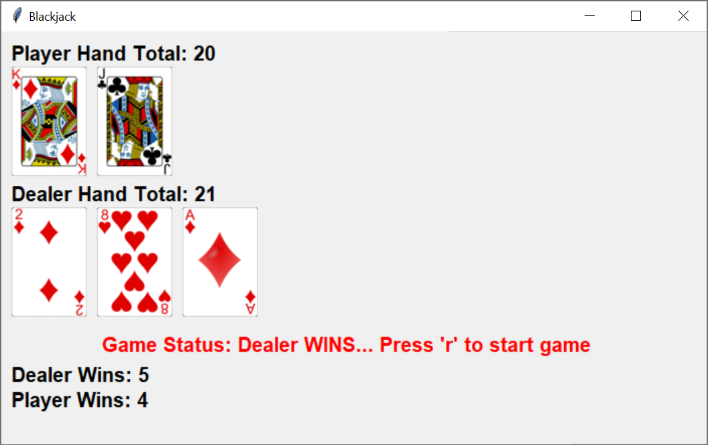

# blackjack
Basic blackjack game - assignment for Python Programming course at UChicago.

To run: In terminal, `cd` into the blackjack directory and type `ipython blackjack.py`.

To play: Click on BlackJack gui and type `h` to hit or `s` to stand. Type `r` to start a new game.

